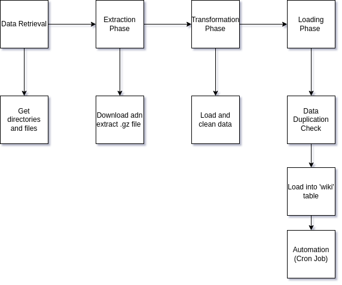

# Report

This report provides a detailed description of the ETL process, considerations for scalability, and a high-level architecture diagram of the ETL pipeline.

## ETL Approach
Here I describe my ETL pipeline in detail:  

**Data Retrieval**

First, I retrieved a list of directories from the homepage and selected the most recent month. I then navigated into that directory and compiled a list of all the files it contained.

**Extraction Phase**

For the extraction phase, I processed each file. This involved downloading the compressed .gz files and saving them in a directory structured as 'download/month/language'. After downloading, I extracted these files and stored them in the same directory.

**Transformation Phase**

During the transformation phase, I loaded the saved file using the pandas library and cleaned the loaded pandas dataframe. 

**Loading Phase**

I used the PostgreSQL Python library to create a table named 'wiki', and loaded the transformed dataframe into this table. To identify the month and language the data belonged to in future analyses, I included new columns for the month and language during the loading process.

**Data Duplication Check**

To avoid loading the data again, if we run a new pipeline, the data won't be loaded if the target table already contains the data of the month.

**Automation**

To ensure the code runs each month to load the data of the last month, we set up a cron job that will run the ETL pipeline code each month at the third day. The rationale behind choosing the third day for data loading is to account for potential delays in Wikimedia's data upload process, which may not occur promptly on the first day.

### ETL Diagram

This is a diagram providing a simplified overview of our ETL approach.  

## Scalability and Performance Design:  

### Data Partitioning:

As data in our target table grows, we can use Data Partitioning. This method involves splitting our table data into separate sections or partitions. This can speed up the process of querying data from our table.

We can organize these partitions based on different factors. For example, we could create partitions for each month the data comes from or based on the language of the Wikimedia data.

The advantage of partitioning is evident when we need to retrieve data for a specific month. Instead of scanning the entire table, we can go straight to the relevant partition. This approach significantly narrows down the area we need to search, making our queries faster and more efficient.

### Asynchronous Processing
Operations not needing to be completed immediately can be moved to asynchronous processing. The benefit of using Asynchronous processing is that some processes that are time-consuming and do not need to be satisfied immediately, for example, uncompressing the gz compressed files, can be moved to an Asynchronous process so that the primary ETL process does not halt when the code is uncompressing the compressed files.

### Archiving Data
Not all data needs to be readily available all the time. For example, old data may not required in the future so that we can archive old files and old data in the database to different systems and databases.

### Distributed Systems:
Loading the data frame to the database is the most time-consuming process in our pipeline; as data volume increases and we have a lot of files to load into the data, the process can be very long. We can use Distributed Systems to load the file to the database to avoid that.  
Different files can be distributed to other systems so that each system processes additional files, and ETL process time can be reduced.

### Monitoring and Performance Tuning

Keeping a regular check on the system can help us spot problems and areas that need to be better.  This can involve tracking metrics like query performance, CPU usage, memory usage, and disk I/O.